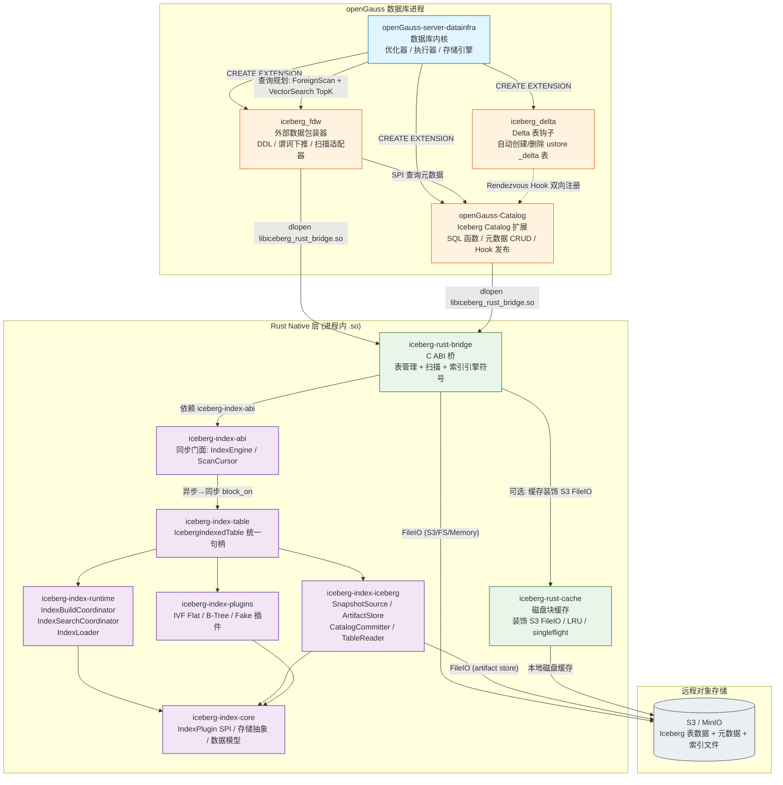
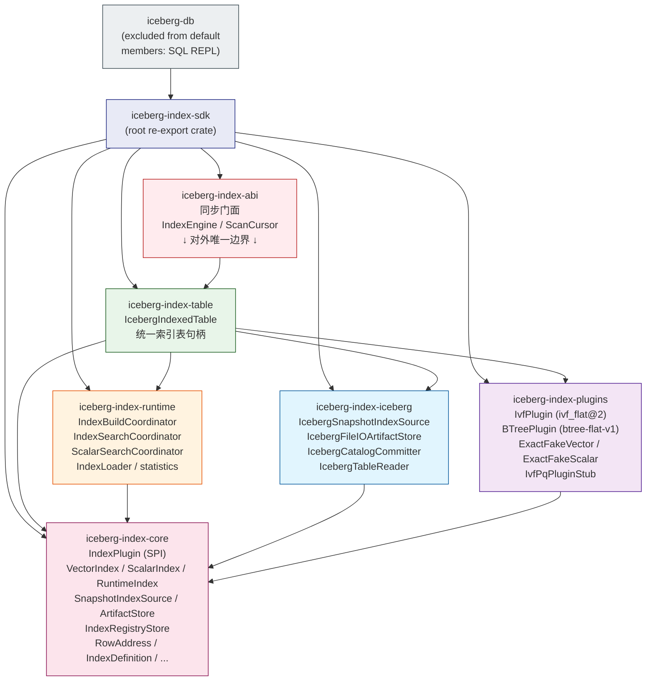
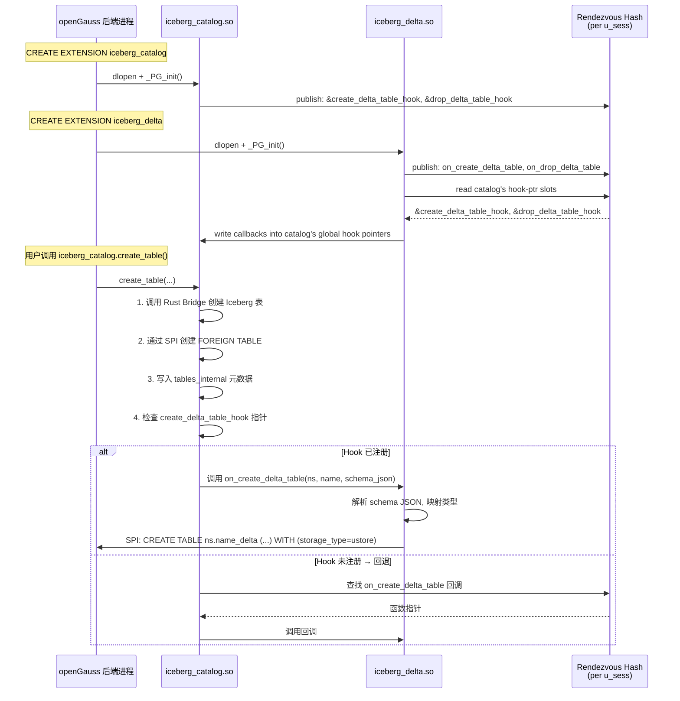
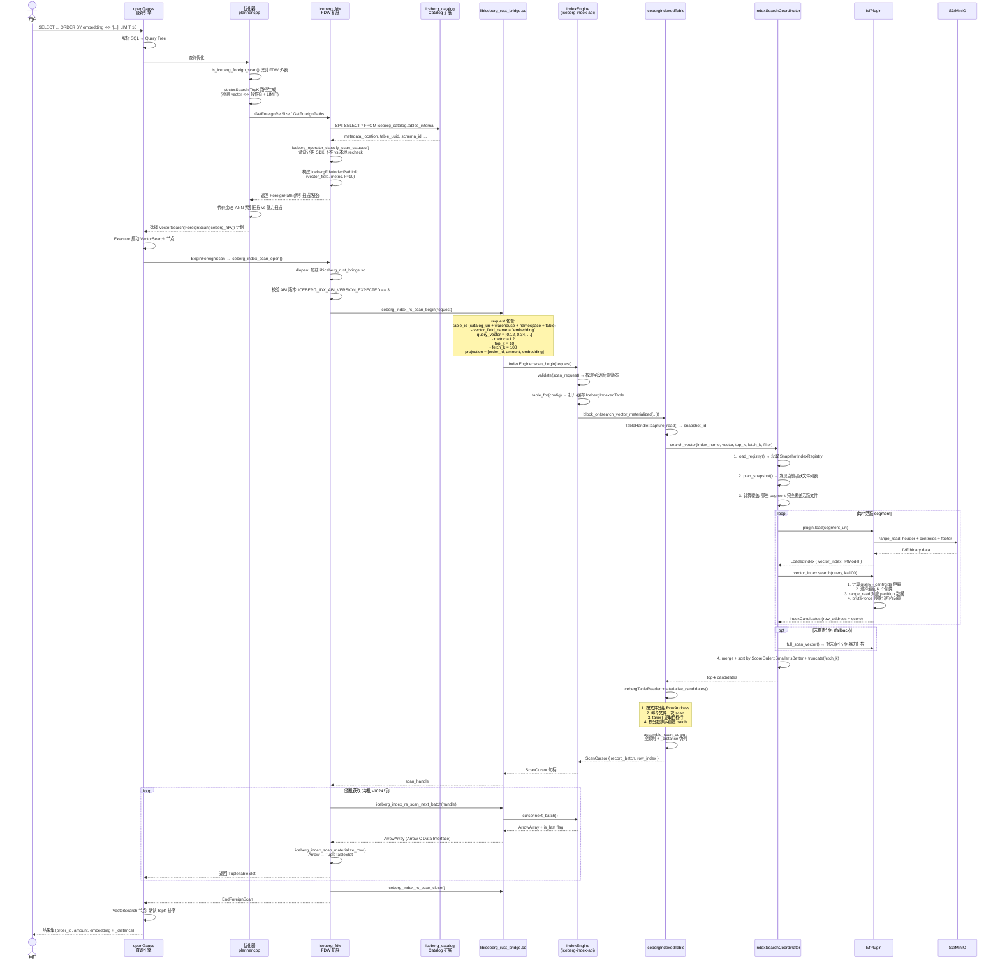

# openGauss Iceberg 湖表能力扩展 — 七组件架构与调用关系

> 本文档分析 `bridge_index_test` 目录下七个组件的职责、架构分层、调用关系，并通过 Mermaid 图展示整体拓扑，最后以一个向量检索查询为例，追踪端到端的完整调用链路。

---

## 一、七组件概览

| # | 组件目录 | 语言 | 形态 | 核心职责 |
|---|---------|------|------|---------|
| 1 | `openGauss-server-datainfra` | C/C++ | 数据库服务器 (fork of openGauss 7.0) | 宿主数据库内核：优化器 (Iceberg FDW 识别 + VectorSearch TopK)、存储引擎 (ustore/DataVec)、扩展加载框架 |
| 2 | `openGauss-Catalog` | C/C++ | PostgreSQL 扩展 (`iceberg_catalog.so`) | Iceberg REST Catalog 的 openGauss 实现：namespace/table CRUD、元数据持久化、通过 Rust Bridge 对接 Iceberg SDK |
| 3 | `iceberg_fdw` | C/C++ | PostgreSQL 扩展 (`iceberg_fdw.so`) | Iceberg 外表包装器：DDL 校验、谓词下推、全表扫描、向量索引扫描 (ANN)、Arrow→TupleSlot 物化 |
| 4 | `iceberg_delta` | C/C++ | PostgreSQL 扩展 (`iceberg_delta.so`) | Delta 表自动管理：Hook 机制监听 create/drop table 事件，自动创建/删除同名 ustore `_delta` 表 |
| 5 | `iceberg-rust-bridge` | Rust | 动态库 (`libiceberg_rust_bridge.so`) | Rust→C ABI 翻译层：暴露 `iceberg_bridge_*`（表管理/扫描/元数据/写入）和 `iceberg_index_rs_*`（索引引擎）两套 C 符号 |
| 6 | `iceberg-index` | Rust | 多 crate 工作空间 | Iceberg 快照级索引 SDK：插件 SPI、IVF/BTree 算法、构建/搜索编排、统一索引表句柄、ABI 门面 |
| 7 | `iceberg-rust-cache` | Rust | 库 crate | 进程本地固定块磁盘缓存：装饰 Iceberg FileIO，对 Parquet 数据文件做 LRU 缓存 + singleflight 合并 |

---

## 二、整体架构 Mermaid 图

### 2.1 组件分层与调用拓扑



### 2.2 iceberg-index 内部层级 (7 crates)



### 2.3 扩展间 Rendezvous Hook 机制



---

## 三、C ABI 符号全景

`libiceberg_rust_bridge.so` 导出两套符号族，供 C/C++ 扩展通过 `dlopen` 调用：

### 3.1 托管表 ABI (`iceberg_bridge_*`)

| 类别 | 符号数 | 关键函数 |
|------|--------|---------|
| 版本/能力 | 2 | `iceberg_bridge_version()`, `iceberg_bridge_capabilities_json()` |
| 字符串生命周期 | 2 | `iceberg_bridge_string_data()`, `iceberg_bridge_string_free()` |
| 错误处理 | 4 | `iceberg_bridge_error_code()`, `*_message()`, `*_context_json()`, `*_free()` |
| 存储 | 2 | `iceberg_bridge_storage_open()`, `*_release()` |
| 表管理 | 6 | `*_table_create()`, `*_table_load()`, `*_table_commit()`, `*_metadata_location()`, `*_metadata_write()`, `*_table_free()` |
| 元数据访问 | 16 | `*_table_format_version()`, `*_uuid()`, `*_location()`, `*_metadata_json()`, `*_current_schema_json()`, `*_current_snapshot_id()`, `*_schemas_json()`, `*_schema_by_id()`, `*_snapshots_json()`, `*_snapshot_by_id()`, `*_properties_json()`, `*_partition_specs_json()`, `*_default_partition_spec_json()`, `*_partition_spec_by_id()`, `*_sort_orders_json()`, `*_statistics_json()` |
| 扫描 | 7 | `*_scan_open()`, `*_scan_plan_files()`, `*_file_scan_task_list_size()`, `*_file_scan_task_json()`, `*_file_scan_task_list_free()`, `*_scan_to_arrow_stream()`, `*_scan_free()` |
| 写入 | 1 | `*_write_parquet()` |

### 3.2 索引引擎 ABI (`iceberg_index_rs_*`)

| 类别 | 符号数 | 关键函数 |
|------|--------|---------|
| 生命周期 | 3 | `*_abi_version()`, `*_open()`, `*_close()` |
| 错误 | 3 | `*_error_code()`, `*_error_message()`, `*_error_free()` |
| 发现 | 4 | `*_match_index()`, `*_descriptor_free()`, `*_list_indexes()`, `*_list_indexes_free()` |
| 规划 | 2 | `*_estimate_access()`, `*_estimate_access_free()` |
| 扫描（数据面） | 5 | `*_scan_begin()`, `*_scan_schema()`, `*_scan_next_batch()`, `*_scan_rescan()`, `*_scan_close()` |
| 控制面 | 8 | `*_create()`, `*_drop()`, `*_alter()`, `*_submit_refresh()`, `*_submit_reindex()`, `*_submit_optimize()`, `*_get_job()`, `*_job_status_free()` |
| 作业管理 | 3 | `*_list_jobs()`, `*_int64_array_free()`, `*_cancel_job()` |
| 其他 | 4 | `*_describe()`, `*_statistics()`, `*_string_free()`, `*_prewarm()`, `*_unload()` |

---

## 四、端到端查询调用示例

### 场景：向量近似最近邻 (ANN) 检索

**假设**：已在 `orders` 表上通过 `iceberg_catalog.create_table()` 创建了 Iceberg 托管表，并在 `embedding` 列上构建了 IVF Flat 向量索引。

**用户 SQL**：
```sql
SELECT order_id, amount, embedding
FROM orders
ORDER BY embedding <-> '[0.12, 0.34, ..., 0.78]'::vector
LIMIT 10;
```

### 4.1 查询端到端调用链路



### 4.2 分阶段详解

#### 阶段 1 — 解析与规划

1. openGauss 解析器将 SQL 转为 Query Tree。
2. 优化器 (`planner.cpp`) 通过 `is_iceberg_foreign_scan()` 识别出目标表是 `iceberg_fdw` 外表。
3. 优化器检测到 `vector <-> constant` 距离操作符 + `LIMIT` 子句，触发 VectorSearch TopK 路径生成（参见 `doc/IndexedIceberg/vectorsearch_topk_design.md`）。
4. FDW 的 `GetForeignPaths` 回调被调用：
   - `iceberg_catalog_get_table_info()` 通过 SPI 查询 `iceberg_catalog.tables_internal` 获取元数据位置。
   - `iceberg_operator_classify_scan_clauses()` 将 WHERE 条件分类为 SDK 可下推谓词和本地 recheck 表达式。
   - 构建 `IcebergFdwIndexPathInfo`，包含向量字段名、距离度量、top_k 等参数。
5. 优化器比较索引扫描和全表扫描的代价，选择 ANN 索引路径。

#### 阶段 2 — 索引扫描初始化

1. 执行器启动 VectorSearch 节点 → 触发 FDW 的 `BeginForeignScan`。
2. `iceberg_index_scan_open()` 被调用：
   - 通过 `dlopen` 加载 `libiceberg_rust_bridge.so`。
   - 校验 `iceberg_index_rs_abi_version()` 的返回值是否匹配期望版本 (v3)。
3. 调用 `iceberg_index_rs_scan_begin()`，传入完整请求：
   ```json
   {
     "table_id": {"catalog_uri": "...", "warehouse": "s3://...", "namespace": "db", "table": "orders"},
     "index_name": "embedding_idx",
     "vector_field": "embedding",
     "query_vector": [0.12, 0.34, ...],
     "metric": "l2",
     "top_k": 10,
     "fetch_k": 100,
     "projection": ["order_id", "amount", "embedding"],
     "filter": null
   }
   ```

#### 阶段 3 — 索引搜索 (Rust 内部)

1. `IndexEngine` (abi 层) 通过 `block_on` 调用异步 `IcebergIndexedTable::search_vector_materialized()`。
2. `IndexSearchCoordinator` 编排搜索流程：
   - **加载 registry**：从 Iceberg 表的 `StatisticsFile` 中读取 `SnapshotIndexRegistry`（Puffin blob: `huawei.gauss-infra.index-meta-v1`）。
   - **规划快照**：调用 `IcebergSnapshotIndexSource::plan_snapshot()` 获取当前快照的数据文件列表。
   - **计算覆盖**：对比 registry 中的 segment 文件覆盖范围与当前快照文件，确定哪些 segment 完全有效、哪些分区需要 fallback。
3. 对每个有效 segment：
   - `IndexLoader` 调用 `IvfPlugin::load()`，从 S3 做 range-read 读取 IVF header + centroids + footer。
   - `IvfModel::search()`：计算查询向量到所有聚类中心的 L2 距离，选择最近 K 个聚类，读取对应 partition 数据，在分区内暴力搜索。
4. 对未覆盖的分区，fallback 到 `full_scan_vector()` 暴力扫描。
5. 合并所有结果，按 `ScoreOrder::SmallerIsBetter` 排序，截断到 `fetch_k=100` 行。

#### 阶段 4 — 回表物化

1. `IcebergTableReader::materialize_candidates()`：
   - 将 100 个候选按数据文件分组。
   - 对每个文件发起一次 Iceberg 扫描，读取原始 Arrow 数据。
   - 使用 `take()` 操作精确提取目标行。
   - 按分数排序重建完整 RecordBatch（包含所有表列）。
2. `assemble_scan_output()`：投影出 `[order_id, amount, embedding]` 三列 + 追加 `_distance` 伪列。
3. 返回 `ScanCursor`（1024 行分页）。

#### 阶段 5 — 数据回流 (Arrow C Data Interface)

1. FDW 循环调用 `iceberg_index_rs_scan_next_batch()` → Bridge 调用 `cursor.next_batch()` → 返回零拷贝 `ArrowArray`（通过 Arrow C Data Interface 的 `ArrowArrayStream` 协议）。
2. FDW 的 `iceberg_index_scan_materialize_row()` 将 Arrow 列式数据逐行转换为 openGauss 的 `TupleTableSlot` 行式格式（丢弃 `_distance` 列）。
3. 每批数据通过 VectorSearch 节点返回给执行器。

#### 阶段 6 — 最终返回

1. VectorSearch 节点确认 TopK 排序正确性（如果 FDW 已排序，则为 no-op）。
2. openGauss 执行器将最终 10 行结果返回给客户端。

---

## 五、组件依赖矩阵

| | openGauss-server | openGauss-Catalog | iceberg_fdw | iceberg_delta | iceberg-rust-bridge | iceberg-index | iceberg-rust-cache |
|---|---|---|---|---|---|---|---|
| **openGauss-server** | — | 加载为扩展 | 加载为扩展 | 加载为扩展 | — | — | — |
| **openGauss-Catalog** | 链接服务器头文件 | — | — | Hook 发布者 | dlopen 调用 | — | — |
| **iceberg_fdw** | 链接服务器头文件 | SPI 查询 | — | 预留桩 | dlopen 调用 | — | — |
| **iceberg_delta** | 链接服务器头文件 | Hook 订阅者 | — | — | — | — | — |
| **iceberg-rust-bridge** | — | — | — | — | — | 依赖 abi crate | 可选集成 |
| **iceberg-index** | — | — | — | — | — | — | — |
| **iceberg-rust-cache** | — | — | — | — | 反向依赖 | — | — |

---

## 六、关键设计决策

### 6.1 为什么需要 Rust Bridge？

- Iceberg Rust SDK (`apache/iceberg-rust` 0.9.1) 提供完整的表格式读写、快照管理、Schema 演化、事务提交能力。
- openGauss 以 C/C++ 编写，无法直接调用 Rust async API。
- `iceberg-rust-bridge` 的角色：**纯翻译层**——将 C 结构体转为 Rust 类型，`block_on` 异步调用，结果转回 C 类型。不持有业务逻辑。

### 6.2 为什么 Catalog 和 FDW 分离？

| 维度 | openGauss-Catalog | iceberg_fdw |
|------|-------------------|-------------|
| 职责 | 元数据 CRUD（DDL） | 数据查询（DML） |
| 调用 Bridge | `iceberg_bridge_table_*` (管理面) | `iceberg_bridge_scan_*` + `iceberg_index_rs_*` (数据面) |
| 输出 | JSONB (REST Catalog 兼容) | TupleTableSlot (查询结果) |
| 外部依赖 | — | VectorSearch (openGauss 内核) |

### 6.3 Delta Hook 机制

由于 openGauss 使用 `RTLD_LOCAL` 加载扩展 + `pg_plugin` 随机副本机制，传统的 `dlsym` / 静态链接均不可行。解决方案：
- **Rendezvous Hash**（per `u_sess` 会话级哈希表）：Catalog 发布 Hook 指针地址，Delta 订阅并回写回调函数指针。
- **回退机制**：如果 Catalog 的全局 Hook 指针为空，回退到 rendezvous hash 查找。

### 6.4 索引插件 SPI

`iceberg-index-core` 定义了 `IndexPlugin` trait，算法实现只需提供 `build()` 和 `load()`：
- **IVF Flat**：K-Means 聚类 + partition 内暴力搜索，支持增量 partition 构建。
- **B-Tree**：LanceDB 风格双层设计（in-memory page boundary lookup + on-demand 4K-row Arrow IPC pages）。
- 新算法只需实现 trait 并注册到 `PluginRegistry`，无需改动上层编排逻辑。

### 6.5 缓存策略

`iceberg-rust-cache` 是 **装饰器模式**：包装 Iceberg `FileIO`，对 Parquet 数据文件做固定块（如 4MB）LRU 磁盘缓存：
- **只缓存**：UUID 命名的 Parquet 数据文件（利用 Iceberg 文件名不可变性）。
- **不缓存**：Metadata、Manifest、Delete 文件、无 UUID 路径、本地文件。
- **Singleflight**：并发读同一 block 时合并为单次远端请求。
- **失败降级**：缓存写入失败不影响用户读取。

---

## 七、数据流总结

```
用户 SQL
  │
  ▼
┌──────────────────────────────────────────────────────────┐
│ openGauss 数据库内核                                      │
│  解析 → 优化 (VectorSearch TopK) → 执行                   │
│  planner.cpp: is_iceberg_foreign_scan()                   │
│  vectorsearch_topk: 向量距离排序 + LIMIT 下推              │
└──────────┬───────────────────────────────┬───────────────┘
           │ SPI                          │ Executor
           ▼                              ▼
┌──────────────────┐           ┌──────────────────────────┐
│ openGauss-Catalog │           │ iceberg_fdw               │
│  tables_internal  │◄──────────│  元数据查询 (SPI)         │
│  元数据 CRUD       │           │  DDL 拦截                 │
│  Hook 发布         │           │  谓词下推                 │
└────────┬───────────┘           │  扫描适配器               │
         │                       └────────┬─────────────────┘
         │ dlopen                         │ dlopen
         ▼                                ▼
┌──────────────────────────────────────────────────────────┐
│ libiceberg_rust_bridge.so (C ABI Bridge)                  │
│  iceberg_bridge_table_*   → 表管理 / 元数据 / 提交        │
│  iceberg_bridge_scan_*    → 全表扫描 / Arrow Stream       │
│  iceberg_index_rs_*       → 向量索引引擎 (ANN)            │
│  iceberg_bridge_write_*   → Parquet 写入                  │
│  iceberg-rust-cache       → S3 FileIO 磁盘缓存 (可选)     │
└────────┬─────────────────────────────────────────────────┘
         │
         ▼
┌──────────────────────────────────────────────────────────┐
│ iceberg-index (Rust SDK)                                  │
│  abi → table → runtime → iceberg adapter → plugins        │
│  IndexEngine → IcebergIndexedTable → SearchCoordinator    │
│  → IvfPlugin(BTreePlugin/...) → ArtifactStore → S3/MinIO  │
└──────────────────────────────────────────────────────────┘
```
