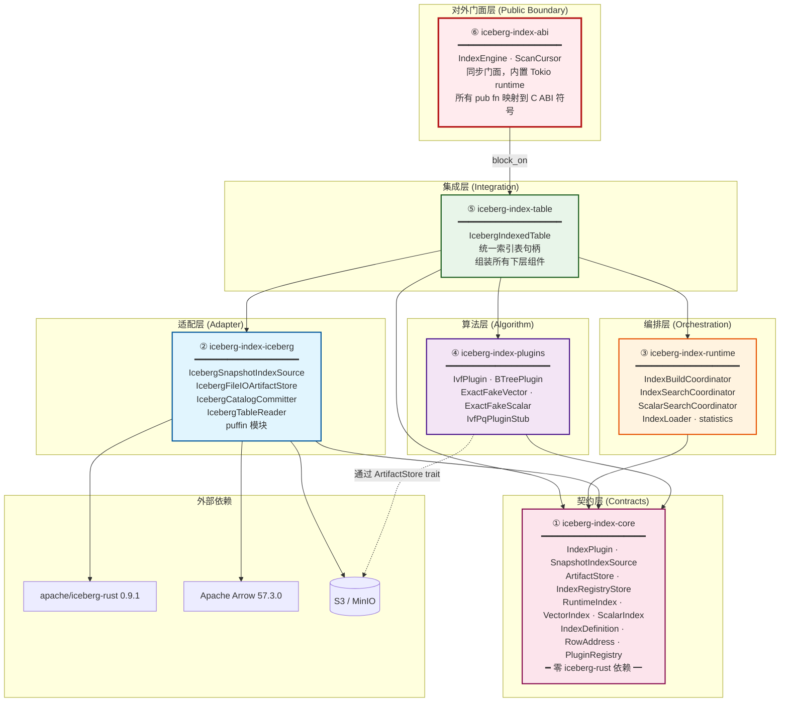
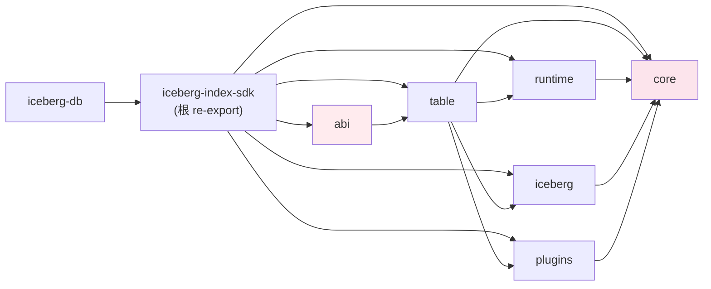
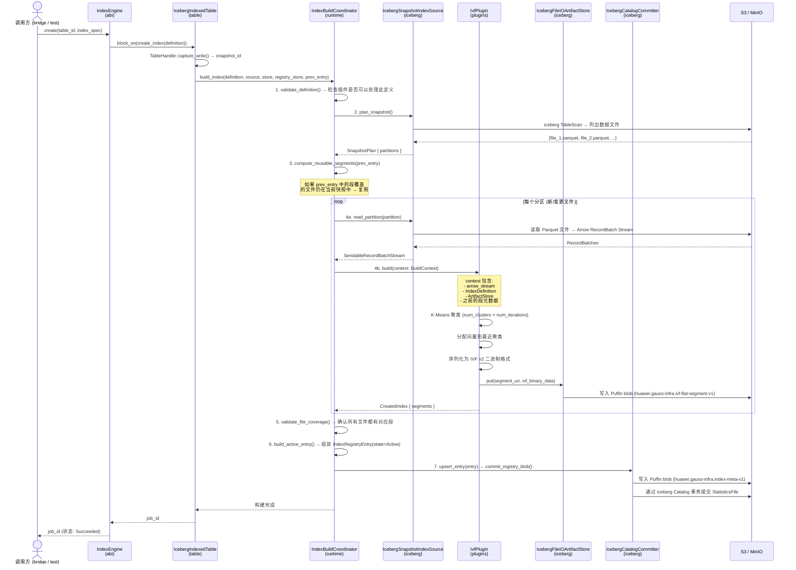
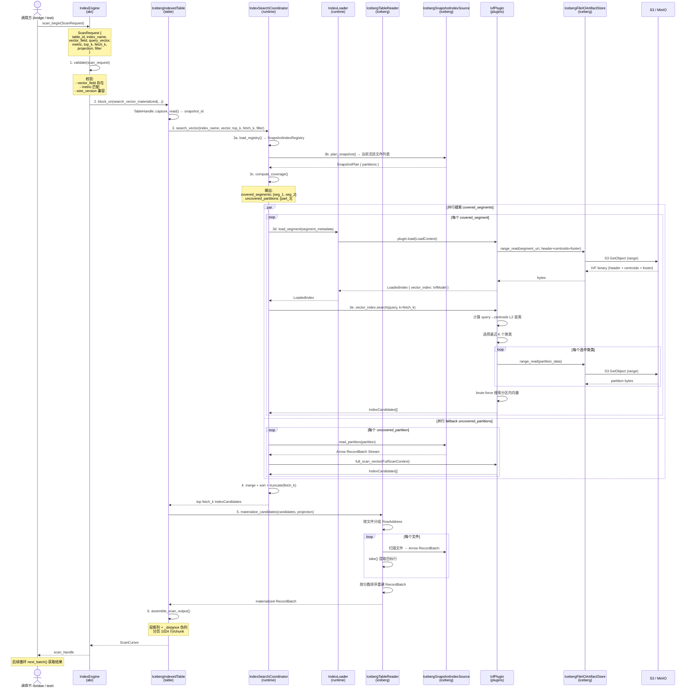
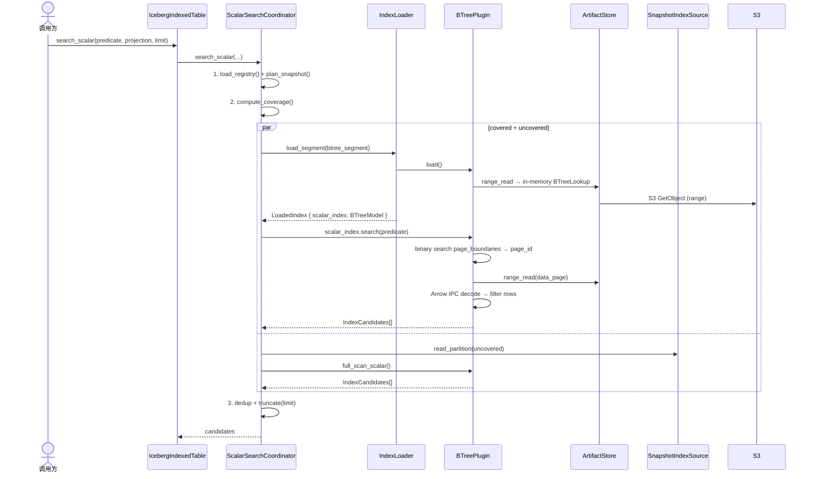
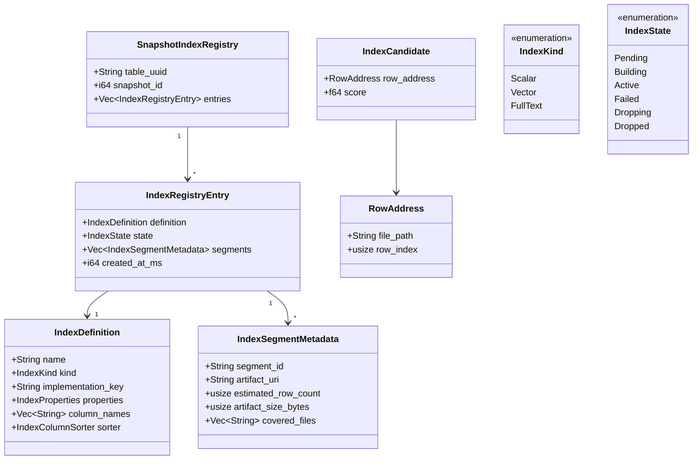
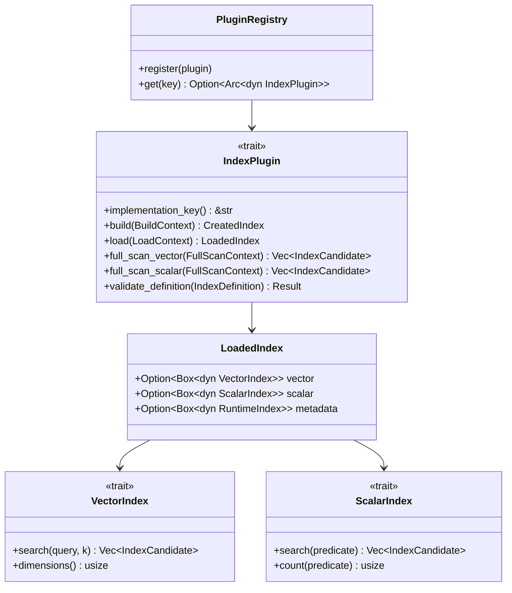

# iceberg-index 内部架构分析

> 本文档深入分析 `iceberg-index` 工作空间的内部架构：7 个核心 crate（含 SDK 根 crate）的分层设计、组件职责、核心 trait/类型体系，以及索引构建与向量检索两条端到端执行流程。

---

## 一、工作空间概览

```
iceberg-index/
├── Cargo.toml                          # workspace root (package: iceberg-index-sdk)
├── rust-toolchain.toml                 # pinned: 1.96 / edition 2024
├── Cargo.lock
│
├── crates/
│   ├── iceberg-index-core/             # ① 存储无关契约层
│   ├── iceberg-index-iceberg/          # ② iceberg-rust 0.9.1 适配层
│   ├── iceberg-index-runtime/          # ③ 编排层
│   ├── iceberg-index-plugins/          # ④ 算法插件层
│   ├── iceberg-index-table/            # ⑤ 统一表句柄层
│   ├── iceberg-index-abi/              # ⑥ C-ABI 对外门面 (PUBLIC boundary)
│   └── iceberg-db/                     # (excluded) SQL REPL 工具
│
└── src/
    └── lib.rs                          # ⑦ iceberg-index-sdk: 统一 re-export
```

**依赖方向**：单向依赖，上层 → 下层。`iceberg-index-core` 是唯一无内部依赖的 crate。

---

## 二、分层架构 Mermaid 图

### 2.1 整体分层



### 2.2 依赖关系图



---

## 三、各组件职责详解

### ① iceberg-index-core — 契约层

**角色**：定义整个 SDK 的抽象接口和数据模型。**零 `iceberg` 依赖**，可独立编译和测试。

| 类别 | 类型 | 职责 |
|------|------|------|
| **算法 SPI** | `IndexPlugin` | 定义索引算法必须实现的 5 个方法 |
| **数据源** | `SnapshotIndexSource` | 从快照读取数据的抽象（schema、plan、read_partition） |
| **存储** | `ArtifactStore` | 二进制大对象读写（raw bytes + Puffin blobs） |
| **注册表** | `IndexRegistryStore` | 快照级索引注册表的 load/commit |
| **运行时索引** | `RuntimeIndex` / `VectorIndex` / `ScalarIndex` | 已加载索引段的搜索契约 |
| **数据模型** | `IndexDefinition` / `IndexRegistryEntry` / `SnapshotIndexRegistry` / `IndexSegmentMetadata` / `RowAddress` / `IndexCandidate` / `IndexKind` / `IndexState` | 索引定义、注册条目、段元数据、行地址、候选结果等 |
| **插件注册** | `PluginRegistry` | 进程级线程安全插件注册表 |

#### `IndexPlugin` trait（算法 SPI 核心）

```rust
pub trait IndexPlugin: Send + Sync {
    fn implementation_key(&self) -> &str;   // 如 "builtin.ivf_flat@2"
    fn build(&self, ctx: BuildContext) -> Result<CreatedIndex>;
    fn load(&self, ctx: LoadContext) -> Result<LoadedIndex>;
    fn full_scan_vector(&self, ctx: FullScanContext) -> Result<Vec<IndexCandidate>>;
    fn full_scan_scalar(&self, ctx: FullScanContext) -> Result<Vec<IndexCandidate>>;
    fn validate_definition(&self, def: &IndexDefinition) -> Result<()>;
}
```

#### `SnapshotIndexSource` trait（数据源抽象）

```rust
pub trait SnapshotIndexSource {
    fn arrow_schema(&self) -> SchemaRef;
    fn plan_snapshot(&self) -> Result<SnapshotPlan>;       // 返回所有数据文件
    fn read_partition(&self, partition: &DataFileGroup) -> Result<SendableRecordBatchStream>;
}
```

#### `ArtifactStore` trait（存储抽象）

```rust
pub trait ArtifactStore {
    // 原始字节 IO
    fn get(&self, uri: &str) -> Result<Bytes>;
    fn put(&self, uri: &str, data: Bytes) -> Result<()>;
    fn delete(&self, uri: &str) -> Result<()>;

    // 结构化 Puffin blob IO
    fn write_blob_metadata(&self, uri: &str, blob_metadata: &[BlobMetadata]) -> Result<()>;
    fn read_blob_metadata(&self, uri: &str) -> Result<Vec<BlobMetadata>>;
    fn read_blob(&self, uri: &str, blob: &BlobMetadata) -> Result<Bytes>;
}
```

**设计意图**：`core` 定义了"做什么"，不关心"怎么做"。所有 iceberg-rust 依赖都在 `iceberg-index-iceberg` crate 中实现。

---

### ② iceberg-index-iceberg — 适配层

**角色**：将 `iceberg-index-core` 的抽象 trait 与 `apache/iceberg-rust` 0.9.1 的具体实现对接。这是**唯一依赖 iceberg crate** 的 crate。

| 实现 | 适配的 trait | 核心逻辑 |
|------|-------------|---------|
| `IcebergSnapshotIndexSource` | `SnapshotIndexSource` | 使用 iceberg-rust `TableScan` API 规划文件、读取 Arrow 数据；注入 `_index_row_position` 伪列；将 VECTOR 列从 Utf8 转为 `List<Float32>` |
| `IcebergFileIOArtifactStore` | `ArtifactStore` | 基于 iceberg `FileIO` 的 blob 读写；内置 segment 缓存（read_blob_metadata + read_blob 共享一次文件读取）；Puffin 格式写入 (`PuffinWriter`) 与自定义 footer 解析 |
| `IcebergCatalogCommitter` | 提交器 | 将 `SnapshotIndexRegistry` 序列化为 Puffin blob (`huawei.gauss-infra.index-meta-v1`)，通过 Iceberg Catalog 事务以 `StatisticsFile` 形式原子提交 |
| `IcebergIndexRegistryStore` | `IndexRegistryStore` | 封装 `IcebergCatalogCommitter`，支持 catalog-backed 和 in-memory 两种模式 |
| `IcebergTableReader` | 独立工具 | 按 `RowAddress` 回表读取：按文件分组 → 单文件单次扫描 → `take()` 提取目标行 → 按分数排序重建 RecordBatch |
| `puffin` 模块 | 独立工具 | 自定义 Puffin v1 footer 字节级解析器（不依赖 Iceberg SDK） |

#### 关键适配细节

- **`_index_row_position` 注入**：iceberg-rust 0.9 不暴露原生 `_pos`，因此在扫描时为每行附加一个文件内递增序号。
- **VECTOR 类型转换**：Iceberg 表的 `VECTOR` 列以 `Utf8` 字符串存储（如 `"[0.1,0.2,0.3]"`），适配层将其解析为 Arrow `List<Float32>`。
- **Puffin Blob 类型**：
  - `huawei.gauss-infra.index-meta-v1`：快照索引注册表
  - `huawei.gauss-infra.ivf-flat-segment-v1`：IVF Flat 索引段数据

---

### ③ iceberg-index-runtime — 编排层

**角色**：实现索引的构建、搜索、加载、统计等**框架级编排逻辑**。不依赖 iceberg crate，仅依赖 core。

| 组件 | 职责 | 核心流程 |
|------|------|---------|
| `IndexBuildCoordinator` | 索引构建编排 | 验证定义 → 规划快照 → 计算可复用段 → 按分区构建 → 验证覆盖 → 写注册表 |
| `IndexSearchCoordinator` | 向量检索编排 | 加载注册表 → 规划快照 → 计算段覆盖 → 搜索有效段 + fallback 未覆盖分区 → 合并排序截断 |
| `ScalarSearchCoordinator` | 标量检索编排 | 同上模式，对标量索引 |
| `IndexLoader` | 段加载器 | 按需加载索引段，进程级 LRU 缓存 |
| `statistics` 模块 | 统计计算 | 聚合 rows/files/artifact_sizes 等指标 |

#### `IndexSearchCoordinator` 覆盖模式

```
当前快照文件: [A, B, C, D, E]
注册表中的段:
  segment_1: 覆盖 [A, B]
  segment_2: 覆盖 [B, C]  ← B 重复，但全量覆盖视为有效

覆盖分析:
  ✅ 有效段:  segment_1 (A,B 全在快照中)
  ❌ 过期段:  无
  ⚠️ 未覆盖:  C, D, E → fallback full_scan_vector()
```

---

### ④ iceberg-index-plugins — 算法层

**角色**：实现具体的索引算法。只依赖 `iceberg-index-core`，**不直接接触 iceberg**。

| 插件 | implementation_key | 类型 | 状态 | 核心算法 |
|------|-------------------|------|------|---------|
| **IvfPlugin** | `builtin.ivf_flat@2` | 向量 | ✅ 完整 | IVF Flat: K-Means 聚类 + partition 内 brute-force；自定义 v2 二进制格式 (header + centroids + partition blocks + footer)；LRU partition 缓存；L2 距离 |
| **BTreePlugin** | `huawei.gauss-infra.btree-flat-v1` | 标量 | ✅ 完整 | LanceDB 风格双层设计：in-memory page boundary lookup + on-demand 4096-row Arrow IPC data pages；支持 Int32/Int64/Utf8/LargeUtf8/Float64 |
| **ExactFakeVectorPlugin** | `test.exact_vector@1` | 向量 | ✅ 测试 | JSON 序列化 + 暴力 L2 搜索（SDK 生命周期验证用） |
| **ExactFakeScalarPlugin** | `test.exact_scalar@1` | 标量 | ✅ 测试 | 精确标量过滤（SDK 生命周期验证用） |
| **IvfPqPluginStub** | `stub.ivf_pq@1` | 向量 | 🚧 桩 | 返回 `AlgorithmNotImplemented`，预留给未来的 Lance IVF-PQ 适配 |

#### IVF Flat 二进制格式 (v2)

```
┌────────────────────────────────┐
│  Header                        │
│  - magic: "IVFFLAT"            │
│  - version: 2                  │
│  - num_clusters, dimension,    │
│    metric, num_vectors         │
├────────────────────────────────┤
│  Centroids                     │
│  [cluster_0: [f32; d],         │
│   cluster_1: [f32; d], ...]    │
├────────────────────────────────┤
│  Partition Blocks              │
│  block_0: [vec_ids + vectors]  │
│  block_1: [vec_ids + vectors]  │
│  ...                           │
├────────────────────────────────┤
│  Footer Index                  │
│  - partition_offsets[]         │
│  - partition_sizes[]           │
│  - crc32 checksum              │
└────────────────────────────────┘
```

**加载策略**：`IvfPlugin::load()` 只读取 header + centroids + footer（O(1) 大小），partition 数据在搜索时按需 range-read 并 LRU 缓存。

#### B-Tree 双层设计

```
BTreeLookup (in-memory, always loaded)
  page_boundaries: [key_0, key_4096, key_8192, ...]
  ── binary search → target page_id

Data Pages (on-demand, LRU cached)
  page_0: Arrow IPC (4096 rows) ── loaded via ArtifactStore range-read
  page_1: Arrow IPC (4096 rows)
  ...
```

---

### ⑤ iceberg-index-table — 集成层

**角色**：将 runtime + iceberg + plugins 组装为一个统一的 `IcebergIndexedTable` 句柄。这是 SDK 的内部集成点。

#### `IcebergIndexedTable` 构造路径

```rust
// 生产路径: 通过 Iceberg Catalog 打开
IcebergIndexedTable::open_with_catalog(catalog, table_ident)
  → 创建 IcebergSnapshotIndexSource (快照源)
  → 创建 IcebergFileIOArtifactStore (文件 IO)
  → 创建 IcebergIndexRegistryStore + IcebergCatalogCommitter (注册表持久化)
  → 注册 builtin 插件到 PluginRegistry
  → 创建 IndexBuildCoordinator + IndexSearchCoordinator + ScalarSearchCoordinator
  → 创建 IndexLoader

// 测试路径: 注入任意实现
IcebergIndexedTable::from_parts(source, artifact_store, registry_store, ...)
```

#### `TableHandle` — 快照管理

```
TableHandle
  ├── LatestTracking    → 自动从 Catalog 加载最新快照
  └── PinnedSnapshot    → 只读固定快照（可重复读）
```

| 方法 | 职责 |
|------|------|
| `create_index()` / `rebuild_index()` / `drop_index()` | 索引生命周期管理 |
| `search_vector()` / `search_vector_materialized()` | 向量检索（带/不带回表物化） |
| `search_scalar()` | 标量检索 |
| `list_indexes()` / `index_state()` | 索引发现与状态查询 |
| `checkout_snapshot()` / `checkout_latest()` / `view_mode()` | 快照切换 |
| `table()` / `snapshot_id()` / `table_uuid()` / `table_reader()` | 元数据访问 |

---

### ⑥ iceberg-index-abi — 对外门面

**角色**：**整个 iceberg-index 的唯一对外边界**。`iceberg-rust-bridge` 只依赖此 crate。

**核心原则**：
- 所有方法都是同步的 `pub fn`（内部通过 `block_on` 调用异步 SDK）
- 参数和返回值只能是：Rust std 类型、`String`/`Vec`、Arrow 类型、本 crate 类型、`Result<T, IndexError>`
- 禁止 `extern "C"`、裸指针、外部类型
- 每个 `pub fn` 对应一个 `iceberg_index_rs_*` C ABI 符号（由 bridge 实现映射）

#### `IndexEngine` API 分类

| 类别 | 方法 | 说明 |
|------|------|------|
| **生命周期** | `open()` | 创建/获取引擎实例（per config 单例） |
| **构建** | `create()`, `submit_refresh()`, `submit_reindex()` | 同步构建索引，构建完成前阻塞 |
| **删除** | `drop_index()` | 元数据级删除（幂等） |
| **发现** | `list_indexes()`, `match_index()`, `describe()`, `statistics()` | 查询索引状态与统计 |
| **规划** | `estimate_access()` | ANN vs brute-force 代价估算 |
| **扫描** | `scan_begin()` | 启动 ANN 搜索 → `ScanCursor` |
| **作业** | `get_job()`, `list_jobs()`, `cancel_job()` | 作业状态查询（当前构建同步，均为 Succeeded） |
| **缓存** | `prewarm()`, `unload()` | 索引缓存管理 |
| **其他** | `alter()`, `submit_optimize()` | 桩实现 |

#### `ScanCursor` — 分页游标

```
scan_begin() → ScanCursor
  ├── next_batch() → Option<(RecordBatch, is_last)>
  ├── schema() → SchemaRef
  └── rescan() → 重置游标到起始位置

分页: 每批 1024 行
列: 投影列 + _distance(末尾)
```

---

## 四、端到端执行流程

### 4.1 索引构建流程 (Build)



**构建流程关键步骤**：

| 步骤 | 操作 | 说明 |
|------|------|------|
| 1 | **验证定义** | 检查插件 `implementation_key` 是否匹配，`IndexDefinition` 参数是否合法 |
| 2 | **规划快照** | 通过 `SnapshotIndexSource::plan_snapshot()` 获取当前快照的全部数据文件及分区 |
| 3 | **计算可复用段** | 对比上一版注册表中的段：如果段覆盖的所有文件仍在当前快照中，则直接复用（增量构建） |
| 4 | **逐分区构建** | 对每个有新增/变更文件的分区：读取 Arrow 数据 → 调用 `plugin.build()` → 写入索引段 |
| 5 | **验证覆盖** | 确认插件生成的段完整覆盖了所有传入的数据文件 |
| 6 | **组装注册条目** | 将新旧段合并为 `IndexRegistryEntry`（state=Active） |
| 7 | **提交注册表** | 通过 `IcebergCatalogCommitter` 将注册表作为 Puffin blob 写入并通过 Catalog 事务原子提交 |

---

### 4.2 向量检索流程 (Search)



**检索流程关键步骤**：

| 步骤 | 操作 | 说明 |
|------|------|------|
| 1 | **验证请求** | 检查向量字段名、距离度量、wire_version 兼容性 |
| 2 | **打开索引表** | 通过 `table_for()` 获取/缓存 `IcebergIndexedTable` |
| 3a | **加载注册表** | 从 StatisticsFile 读取 `SnapshotIndexRegistry` |
| 3b | **规划快照** | 获取当前快照的数据文件列表 |
| 3c | **计算覆盖** | 区分 covered_segments（段文件全在快照中）和 uncovered_partitions（需要 fallback） |
| 3d | **加载段** | `IndexLoader` 缓存 → `plugin.load()` → 只读 header+centroids+footer |
| 3e | **搜索段** | 选择最近 K 个聚类 → range-read partition 数据 → brute-force 搜索 |
| 3f | **Fallback** | 对未覆盖分区调用 `full_scan_vector()` |
| 4 | **合并截断** | 按 `ScoreOrder` 排序，截断到 `fetch_k` |
| 5 | **回表物化** | 按文件分组 `RowAddress` → 扫描文件 → `take()` 提取行 → 排序重建 Batch |
| 6 | **组装输出** | 投影列 + 追加 `_distance`，1024 行分页 → 返回 `ScanCursor` |

---

### 4.3 标量检索流程 (Scalar Search)



---

## 五、核心类型体系

### 5.1 数据模型



### 5.2 运行时 trait 体系



---

## 六、关键设计模式

### 6.1 分层解耦

```
abi 层 (同步门面)
  ↓ block_on
table 层 (集成组装)
  ↓ 委托
runtime 层 (编排)
  ↓ 调用 trait
iceberg 层 (适配) ← 唯一接触 iceberg-rust SDK
  ↓ 实现 trait
core 层 (契约) ← 零外部依赖
```

### 6.2 插件 SPI

- 新算法只需实现 `IndexPlugin` trait 并注册，编排层和集成层无需改动。
- 插件只通过 `ArtifactStore` trait 读写数据，不直接操作文件系统或对象存储。
- 插件只通过 `SnapshotIndexSource` trait 读取源数据，不直接访问 Iceberg API。

### 6.3 增量构建

`IndexBuildCoordinator` 对比新旧注册表，只重建文件变更的分区，未变更的分区段直接复用，避免全量重建。

### 6.4 分阶段加载

`IvfPlugin::load()` 只读取 header + centroids + footer（O(1) 大小），partition 数据在搜索时按需异步 range-read，以 LRU 缓存减少 S3 请求。

### 6.5 覆盖 + Fallback 搜索

`IndexSearchCoordinator` 同时搜索索引覆盖的分区和 fallback 暴力扫描未覆盖分区，结果合并后统一排序截断——确保即使部分索引过期，查询结果仍然完整。
