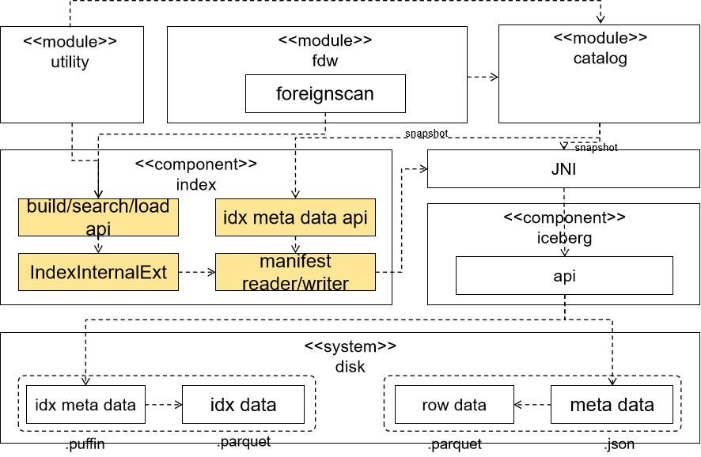

# Infra湖表索引方案

## 架构逻辑视图



## 元信息数据结构

### `IndexMetadata` - 索引段元数据

```c++
  struct IndexMetadata {
      Uuid uuid;                                          // 索引段全局唯一 ID
      std::vector<int32_t> fields;                        // 被索引的字段 ID 列表
      std::string name;                                   // 用户定义的索引名称
      uint64_t dataset_version;                           // 最后更新时的数据集版本号
      std::optional<std::vector<>> covered_data_files;    // 索引覆盖的data_file集合 - 没有fragment*
      uint64_t partition_id;                              // 预留当前索引所在分区信息 - 预留*
      std::optional<std::shared_ptr<prost_types::Any>>    // 索引类型特定详情 (protobuf, Arc<T> → shared_ptr)
          index_details;
      int32_t index_version;                              // 索引格式版本号
      std::optional<DateTime> created_at;                  // 创建时间戳
      std::optional<uint32_t> base_id;                    // 外部索引文件的基础路径 ID
      std::optional<std::vector<IndexFile>> files;        // 索引段文件列表及大小
  };
```

整个体系的**最底层核心结构**，直接序列化存储在 Manifest 中，**没有fragment概念，另外iceberg支持分区，预留分区信息**

### `IndexFile` — 段内文件描述

```C++
struct IndexFile {
    std::string path;       // 相对路径，如 "index.idx"
    uint64_t size_bytes;    // 文件大小（字节）
}
```

 `describe_indices()` 可以报告 `total_size_bytes` 而无需额外的 HEAD 请求。

### `IndexCriteria` — 索引筛选条件

```C++
pub struct IndexCriteria {
    std::string for_column;                   // 限定列名
    std::string has_name;                     // 限定索引名
    bool must_support_fts;                    // 必须支持全文搜索
    bool must_support_exact_equality;         // 必须支持精确等值匹配
}
```

作为 `describe_indices()` 和 `load_scalar_index()` 的**输入参数**。

### `IndexDescription` — 逻辑索引描述

`IndexDescription`作为基类被其他具体索引描述类实现

```c++
class IndexDescription {
    virtual char* name(&self) const = 0;       // 索引名称（跨段统一）
    virtual IndexMetadata metadata() = 0;      // 所有段的原始元数据
    virtual IndexMetadata segments() = 0;      // metadata() 的别名
    virtual char* type_url() const = 0;        // protobuf type URL
    virtual IndexType index_type() = 0;        // 简短类型标识 (BTREE, IVF_PQ...)
    virtual uint64 rows_indexed() const = 0;   // 近似索引行数（跨段求和）
    virtual uint32 field_ids() const = 0;      // 被索引的字段 ID
    virtual std::string details() = 0;         // 索引详情的 JSON 字符串
    virtual uint64 total_size_bytes() = 0;  // 所有段文件总大小
}
```

`describe_indices()` 的**返回值类型**，将多个同名 `IndexMetadata` 段聚合为一个逻辑索引的整体描述。

### `IndexDescriptionImpl` — 索引描述的具体实现

元信息结构体

```rust
struct IndexDescriptionImpl {
    std:: string name;
    std::vector<uint32> field_ids;
    std::vector<IndexMetadata> segments;
    IndexType index_type;
    IndexDetails details;
    uint64 rows_indexed;
}
```

具体实现类

```c++
class BTreeIndexDesc : IndexDescription {}
```


## 索引元信息接口列表

参考lancedb，其中与**获取/查询索引信息**相关的有 9个：

| #    | 方法                        | 输入                                    | 输出                                         | 用途                                 |
| ---- | --------------------------- | --------------------------------------- | -------------------------------------------- | ------------------------------------ |
| 1    | `load_indices`              | 无                                      | `std::future<std::vector<IndexMetadata>>`    | 加载全部索引段元数据（底层基础接口） |
| 2    | `load_index`                | `const Uuid& uuid`                      | `std::future<std::optional<IndexMetadata>>`  | 按 UUID 精确查找                     |
| 3    | `load_indices_by_name`      | `std::string name`                      | `std::future<std::vector<IndexMetadata>>`    | 按名称查找所有索引                   |
| 4    | `load_index_by_name`        | `std::string name`                      | `std::future<std::optional<IndexMetadata>>`  | 按名称查找唯一索引                   |
| 5    | `describe_indices`          | `std::optional<IndexCriteria> criteria` | `std::future<std::vector<IndexDescription>>` | 聚合描述逻辑索引（推荐上层使用）     |
| 6    | `load_scalar_index`         | `const IndexCriteria& criteria`         | `std::future<std::optional<IndexMetadata>>`  | 查找最佳匹配的标量索引               |
| 7    | `index_statistics`          | `std::string index_name`                | `std::future<std::string>（JSON）`           | 获取运行时统计信息                   |
| 8    | `load_indices_by_partition` | `size_t partition_id`                   | `std::future<std::vector<IndexMetadata>>`    | 按照索引查找所有索引                 |
| 9    | `load_index_by_partition`   | `std::string name, size_t partition_id` | `std::future<std::optional<IndexMetadata>>`  | 查找指定分区下指定索引元信息         |

